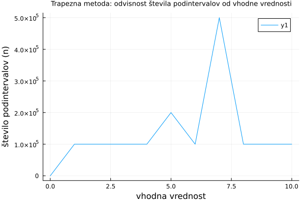

# Integralski sinus in ploščina Bézierove krivulje
Tokratna domača naloga je sestavljena iz dveh delov. 

V prvem delu smo implementirali program za računanje vrednosti dane funkcije $f(x)$. Izbrali smo integralski sinus: $Si(x) = \int_0^x \frac{sin(t)}{t}dt$. Za reševanje smo uporabili integracijske metode. Rešili pa smo na dva načina, najprej s trapezno metodo, nato s Simpsonovo metodo. Nato smo za obe metode pogledali na koliko podintervalov je treba razdeliti interval, da dobimo rezultat z relativno natančnostjo `1e-10`, za različne vhodne vrednosti `x`. Rezultate lahko vidimo na slikah: 

V drugem delu pa je naloga izračunati eno samo številko. Izbrali smo nalogo da izračunamo ploščino zanke, ki jo omejuje Bézierova krivulja dana s kontrolnim poligonom:
$(0,0),(1,1),(2,3),(1,4),(0,4),(−1,3),(0,1),(1,0)$. Bézierova krivulja je parametrična krivulja, ki se večinoma uporablja v računalniški grafiki. Leta 1962 jo je razširil francoski inženir Pierre Etienne Bézier, ki jo je uporabil pri oblikovanju avtomobilskih teles.
Prvo smo implementirali funkcijo, ki izračuna točko Bézierove krivulje (parametriranje) glede na kontrolni poligon in parameter t. `t` je parameter krivulje, ki je med 0 in 1. Potem smo izračunali ploščino zanke, ki jo omejuje krivulja, tako da smo med vsakim dvema zaporednima točkama na krivulji (ki jih dobimo z uporabo prejšnje funkcije) izračunali ploščino trapeza. Na koncu še ploščine vseh trapezov sešteli. Torej za izračun ploščine smo uporabili trapezno metodo. Rezultat je dan na 10 decimalk.

